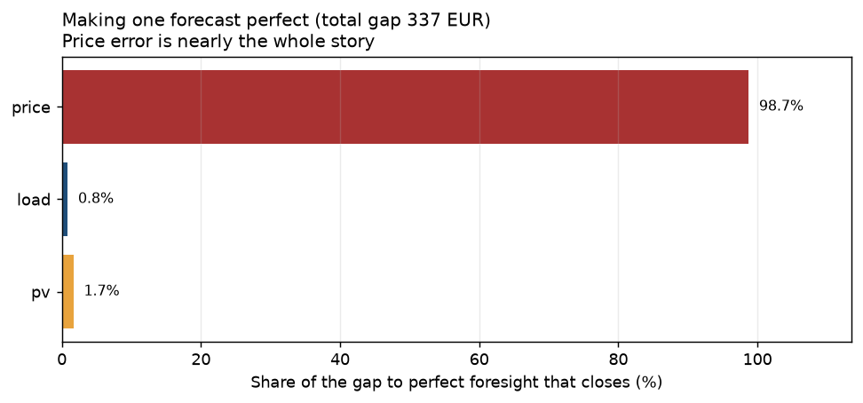
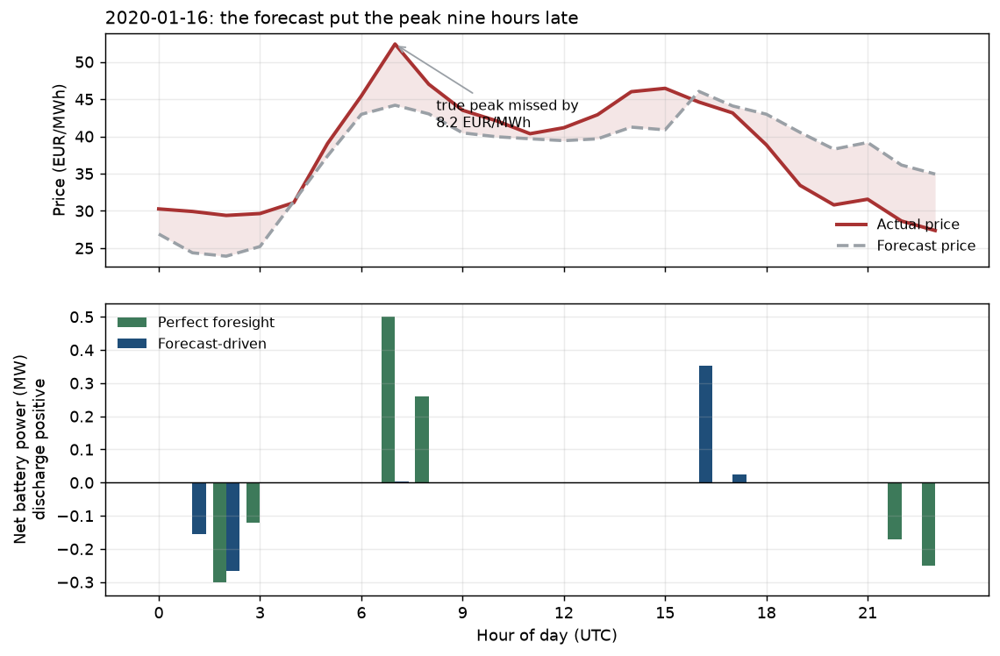
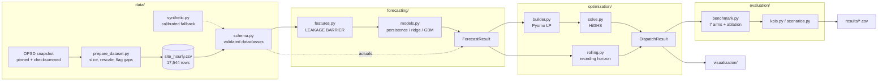
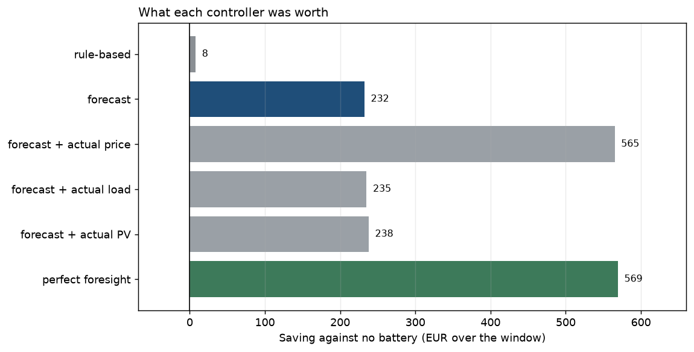
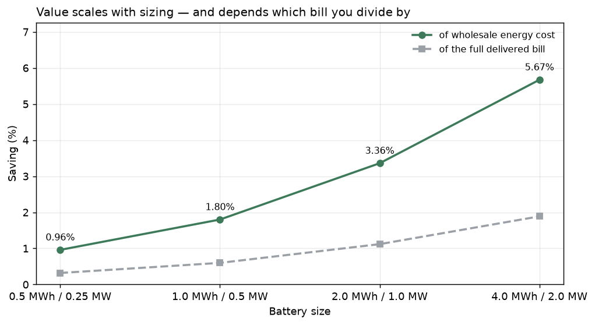

# Forecast-Driven BESS Dispatch

A behind-the-meter battery dispatched against **forecasts**, not against prices
someone already knows. Machine-learning models predict load, PV and wholesale
price; a [Pyomo](https://www.pyomo.org/) linear program turns those predictions
into a charge/discharge schedule; the schedule is then priced against what
actually happened.

The forecasting exists because its output drives an optimization decision. So
the question this repository answers is not "how accurate is the model" but
**what is the forecast worth, and which forecast matters.**

> Built incrementally, phase by phase — see `PROJECT_BRIEF.md` for the scope
> agreed before any code was written, including every place the brief was
> overridden and why. `docs/formulation.md` has the full model,
> `docs/forecasting.md` the model selection.

## The headline

Sixty test days, real DE/LU market data, the brief's own 1 MWh / 0.5 MW battery.

| Controller | Saving vs no battery | Share of the ceiling |
|---|---:|---:|
| Rule-based (greedy self-consumption) | 7.79 EUR | 1.4% |
| **Day-ahead, forecast-driven** | **232.30 EUR** | **40.8%** |
| Day-ahead, perfect foresight | 569.36 EUR | 100% |

Forecast-driven dispatch captures **41%** of what perfect information would be
worth. Re-planning every hour instead of once a day lifts that to 560 EUR —
within 2% of what perfect information buys in the day-ahead framing.

**And the shortfall is almost entirely one series.**



Making the price forecast perfect closes **98.7%** of the gap. Load and PV
together account for 2.5%. That is the actionable result: effort spent on load
or PV accuracy would buy essentially nothing on this site.

## Why forecast error costs money

Not because the optimizer is wrong — because it is right about the wrong prices.



On 2020-01-16 the price forecast under-called the true 52.4 EUR/MWh morning peak
by 8.2 EUR/MWh and over-called the afternoon. Perfect foresight discharges into
the real peak at hour 7; the forecast-driven controller discharges nine hours
late. Both schedules are optimal for the prices they were given.

## Features

- **Leakage is structurally impossible, and that is tested.** `build_features`
  discards every row at or after the issue time as its first statement, so a
  feature cannot reference the future — the rows are not in scope. One function
  serves training and inference, so the two paths cannot drift. The test suite
  corrupts the entire future with noise and requires bit-identical features,
  *and* inserts a deliberate leak to prove the check can fail.
- **Perfect foresight is not a separate code path.**
  `ForecastResult.from_actuals` wraps observed data in the same type a model
  produces, so the benchmark runs through the identical builder and solver. The
  comparison measures information, not two implementations.
- **Ablation by field substitution.** `forecast.with_actual(truth, "price")`
  returns the same type, so asking "how much of the loss is price error?" costs
  one line rather than a second pipeline.
- **No binary variables, and that is measured.** Across export ratios 0.7×,
  1.0× and 1.3×, with and without degradation and demand charges, no optimum
  ever charged and discharged in the same period — round-trip losses already
  make it wasteful. Staying an LP is why 2,880 rolling solves finish in minutes.
- **A tariff guard that a binary would have hidden.** See below.
- **Three objective variants**, all built, because they disagree in an
  instructive way: cost-only *raises* peak import above the no-battery peak.

## The bug that shaped the schema

A probe run with export compensation above the import price produced an optimum
that imported and exported **simultaneously in all 24 hours — with no battery in
the model at all.** That is the meter being gamed, not the battery being used.

The tempting fix is a binary forbidding simultaneous import and export. It is the
wrong fix: it makes an unphysical tariff solve slowly instead of failing, hiding
a data error behind a MILP. The guard belongs in validation.

Negative prices make it subtle, and this dataset has 484 of them. An export price
set at 70% of wholesale is safe while wholesale is positive and **inverts below
zero**: at −90 EUR/MWh importing pays you 90 while exporting costs you 63, so the
round trip nets +27 EUR/MWh forever. `Tariff` rejects it and names the fix:

```
ValueError: export price exceeds import price in period 6012
(export -63.01 > import -90.01 EUR/MWh), by up to 27.00 EUR/MWh across the horizon.
Such a tariff can be arbitraged by importing and exporting at the same time, with
no battery involved, so any dispatch result would be meaningless.
If your prices go negative, this is usually the cause... Raising the import markup
by at least 27.00 EUR/MWh resolves it.
```

## Architecture



The one arrow that matters is the dotted one: actuals reach the optimizer only by
being wrapped in the same `ForecastResult` a model produces. There is no second
path.

## Install

```bash
pip install -e ".[dev,solvers,viz]"
```

[HiGHS](https://highs.dev/) arrives with the `solvers` extra (`highspy`) and is
the only solver needed — the model is a pure LP, so no conda and no Ipopt
anywhere. CBC and GLPK work unchanged if their binaries are on your PATH; pass
`solver_name="cbc"` to `solve_dispatch`.

Optional extras: `boost` (XGBoost, justified on one series of three — see
`docs/forecasting.md`) and `notebooks`.

## Reproduce the baseline

One command, about 16 seconds:

```bash
python -m bess_dispatch.run
```

The committed dataset means a fresh clone runs with no network access. To
regenerate it from source and confirm it round-trips byte for byte:

```bash
python data/download_opsd.py && python data/prepare_dataset.py
```

More expensive stages are opt-in:

```bash
python -m bess_dispatch.run --stage rolling
python -m bess_dispatch.run --stage scenarios
python -m bess_dispatch.run --config configs/scenarios/large_battery.yaml
```

## Quickstart

```python
from bess_dispatch.config import load_config
from bess_dispatch.data.loaders import load_site_frame, split_frame
from bess_dispatch.evaluation.benchmark import fit_forecasters
from bess_dispatch.forecasting.interface import ForecastResult, actuals_for, forecast_horizon
from bess_dispatch.optimization.builder import build_dispatch_model
from bess_dispatch.optimization.solve import solve_dispatch
import pandas as pd

site = load_config().site()
frame = load_site_frame()
fitted = fit_forecasters(split_frame(frame, "train"))

forecast = forecast_horizon(fitted, frame, pd.Timestamp("2020-01-16", tz="UTC"), 24)
truth = actuals_for(frame, forecast)

planned = solve_dispatch(build_dispatch_model(forecast, site))
print(planned.summary())
print(planned.cost_breakdown())        # sums to total_cost_eur by construction

# The same solver, the same builder, actuals instead of predictions.
perfect = solve_dispatch(build_dispatch_model(ForecastResult.from_actuals(truth), site))

# How much of the gap is price error alone?
price_only = forecast.with_actual(truth, "price")
```

## Data

Real market data: **Open Power System Data**, hourly, snapshot `2020-10-06`
(pinned and checksummed — OPSD stopped publishing, which makes it *more*
reproducible). Upstream source is the ENTSO-E Transparency Platform.

Synthetic data is available as a fallback but is **not** used for any reported
number: on synthetic data the forecast-versus-perfect gap would measure whatever
noise the generator injected, making the central result circular.

Two things stated rather than buried:

- **Load and PV are national aggregates rescaled to one site.** The shapes are
  real; the magnitudes are assumptions. A national load curve is smoother, and
  easier to forecast, than a single building's — so load accuracy here is
  optimistic. The ablation measures how much that matters: 0.8% of the gap.
- **The window starts 2018-10-01** because the German/Austrian bidding zone split
  then. There is no `DE_LU` price before it, and the earlier series is a
  different market, so the two are not concatenated.

Full detail: `data/DATA_DICTIONARY.md`, `data/ATTRIBUTION.md`.

## Forecasting

Models are chosen **per series, by validation MAE**, and the result contradicts
the obvious guess:

| Series | Winner | MAE | Skill vs persistence |
|---|---|---:|---:|
| Load | gradient boosting | 0.0228 MW | +59.1% |
| PV | ridge | 0.0151 MW | +5.0% |
| Price | ridge | 7.12 EUR/MWh | +20.8% |

**Both gradient-boosted models lose to "yesterday, same hour" on PV**, and
XGBoost loses hardest at −21% skill. Reported rather than buried: on that series
machine learning did not earn its keep, and the more flexible the model the worse
it did.

The transmission operator's own published day-ahead load forecast is included as
an external benchmark. The gradient-boosted model beats it on MAE (0.0228 vs
0.0237) and **loses to it on RMSE** (0.0382 vs 0.0291) — more accurate typically,
worse in the tail, which is the less comfortable trade for a dispatch decision.

MAPE and sMAPE are reported as `NaN` for price and PV rather than computed over a
filtered subset. Price crosses zero 484 times and PV is zero every night;
filtering would quietly change the question. Details in `docs/forecasting.md`.

## Results



Day-ahead against rolling, same hours, all settled for the state of charge they
end on:

| Controller | Cost (EUR) | Saving | Share of best |
|---|---:|---:|---:|
| No battery | 95,047.53 | — | — |
| Day-ahead forecast | 94,815.23 | 232.30 | 24.8% |
| **Rolling forecast** | **94,487.69** | **559.84** | **59.9%** |
| Day-ahead perfect foresight | 94,478.17 | 569.36 | 60.9% |
| Rolling perfect foresight | 94,112.21 | 935.31 | 100% |

Rolling forecast nearly matches day-ahead perfect foresight. **Better timing and
better information are substitutes here, and the timing is cheaper to buy.**

One confound named rather than hidden: the day-ahead arm is pinned to end each
day where it started, and the rolling arm is not, so the gap is both information
timing *and* daily energy-neutrality. On these numbers the framing costs about as
much as forecast error does (366 vs 375 EUR).

### Sizing



The brief's reference battery saves 1.80% of the wholesale energy component;
quadrupling it reaches 5.67%. Savings are given against two denominators because
the battery can only move the wholesale part — network charges and levies ride
along with every MWh whenever it is taken.

### When the system destroys value

The forecast-driven arm can go **negative**. At half the observed price
volatility it saves −3.89 EUR; at a degradation cost of 10 EUR/MWh, −0.11 EUR.
Perfect foresight stays positive in both. This is forecast error exceeding the
spread the battery is trying to trade — acting confidently on a noisy signal is
worse than not acting. A single reference-case number would never have shown it.

## Interactive demo

```bash
streamlit run app/streamlit_app.py
```

Move the sizing, efficiency and tariff sliders and watch the schedule and the
savings move. It is a visualization layer, not the optimization engine: it calls
the same functions the command line does, and its numbers agree with
`results/benchmark_summary.csv` exactly. Setting an import markup below the
arbitrage threshold halts the app rather than warning.

## Tests

```bash
pytest -v
```

110 tests, about 45 seconds, entirely on the seeded synthetic generator — no
network, no 130 MB download. The few that assert something about the committed
dataset skip cleanly if it is absent.

`tests/test_forecast_leakage.py` is the important one, and it checks three
things: that features ignore a corrupted future, that a **deliberately inserted
leak is caught**, and that the lag/horizon guard refuses an unsafe configuration.
A leakage test that cannot fail produces confidence rather than information.

## Limitations

The ones that would change a real decision:

- **The demand charge is levied on the daily peak.** A real one is monthly, and
  minimising 60 daily peaks is not the same as minimising the month's.
- **Degradation is a throughput proxy**, not electrochemistry — no cycle depth,
  temperature, calendar ageing or C-rate.
- **Point forecasts only**, so the optimizer cannot be made risk-aware. Given
  that price error dominates the shortfall, this is the highest-value extension.
- **No capital cost.** Savings are operational; nothing here says whether the
  battery pays for itself.
- **National load rescaled to a site** — see Data above.
- **Models are never retrained.** The COVID-era `shift` split is held out and
  reported separately for exactly that reason.

Full list with reasoning in `docs/formulation.md` §8.

## Future work

Probabilistic price forecasting feeding a chance-constrained or scenario-based
dispatch is the obvious next step, because the ablation says price uncertainty is
where all the loss lives. After that: a monthly demand-charge horizon, a terminal
value function in place of the terminal-SOC pin, and degradation with cycle-depth
dependence.

## Companion repos

Eight standalone optimization models built to the same conventions — validated
dataclasses that fail loudly at construction, a builder that never touches raw
files, and a result dataclass rather than a live model — but sharing no code.

- [economic-dispatch-pyomo](https://github.com/Ahmadmohammadip/economic-dispatch-pyomo)
  — multi-period, multi-bus DC-OPF economic dispatch with generator
  ramping, curtailable renewables, storage, and locational marginal prices.
- [battery-storage-optimization-pyomo](https://github.com/Ahmadmohammadip/battery-storage-optimization-pyomo)
  — battery energy arbitrage co-optimized with frequency regulation
  capacity (revenue stacking) as a single LP.
  **The wholesale-market counterpart to this repo**: there the prices
  are known, here they are forecast.
- [cvrp-optimization-pyomo](https://github.com/Ahmadmohammadip/cvrp-optimization-pyomo)
  — exact MILP for the Capacitated Vehicle Routing Problem, with a
  measured benchmark of where exact methods stop scaling.
- [supply-chain-network-optimization-pyomo](https://github.com/Ahmadmohammadip/supply-chain-network-optimization-pyomo)
  — multi-echelon network design and production-distribution-inventory
  planning as one MILP: which plants and warehouses to open, and how to
  run them.
- [building-energy-digital-twin](https://github.com/Ahmadmohammadip/building-energy-digital-twin)
  — a stateful digital twin of an office: an RC thermal model identified
  from telemetry, fault detection scored against injected faults, and
  comfort-constrained MPC over HVAC and a battery.
  **The closest sibling to this repo**: here the state is a battery's
  charge and the hard part is predicting price; there the state is a
  building's temperature and the hard part is identifying the physics.
- [resilient-microgrid-optimization](https://github.com/Ahmadmohammadip/resilient-microgrid-optimization)
  — a MILP that operates a distribution feeder through a 72-hour extreme
  event: which lines to close, which sections to energise, what to dispatch
  and what to shed, subject to a radiality constraint that is enforced
  mathematically rather than asserted.
- [llm-energy-optimization-copilot](https://github.com/Ahmadmohammadip/llm-energy-optimization-copilot)
  — natural-language energy requests turned into a validated structured
  intent, solved by a deterministic Pyomo optimizer and explained from the
  numbers it produced — with the LLM confined to interpretation and never
  reaching a solver except through a schema that has to accept it first.
  **The closest sibling to this repo**: here the question is what a forecast
  is worth; there it is what a language model is worth. Both are answered by
  scoring against a deterministic control arm rather than by checking that the
  clever component runs.

## License

MIT — see `LICENSE`. That covers the code only, not the data; see
`data/ATTRIBUTION.md`.
